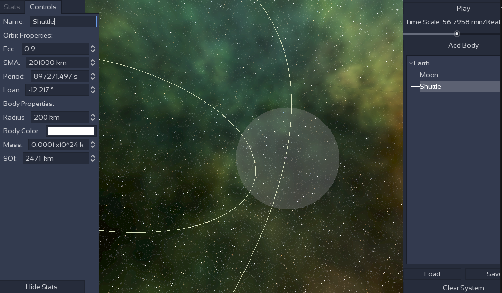

# Patched Conic and orbit editor in Godot
Featuring:
- [x] Editing oribital parameter
- [x] Realistic velocity and position according to time
- [x] Saving and loading scenes from files1
- [ ] Manuever Nodes/Editing of velocity to change orbit like an acutal spacecraft

